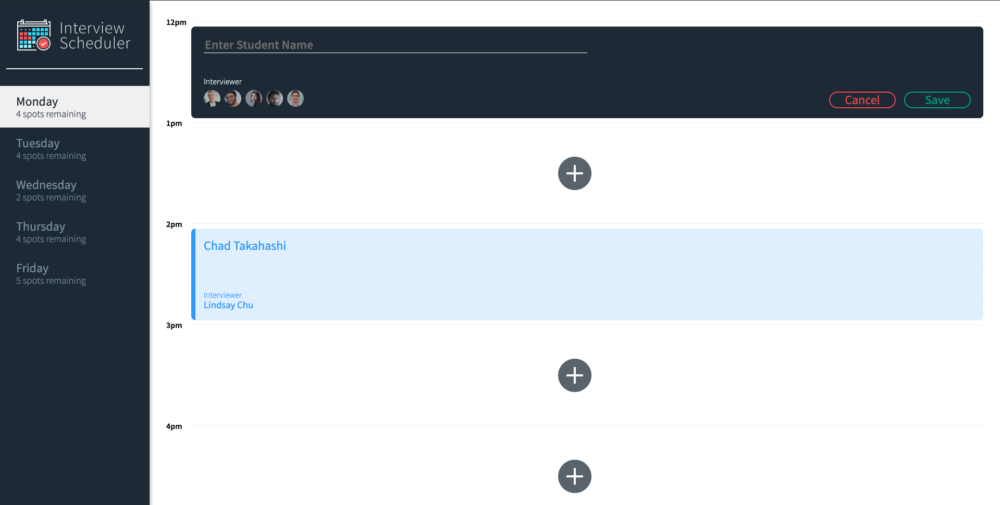
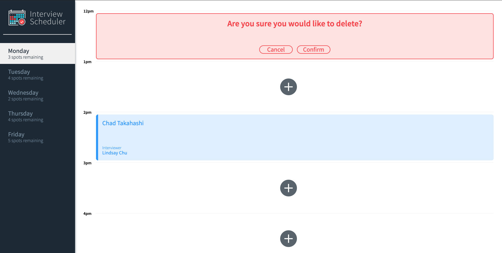
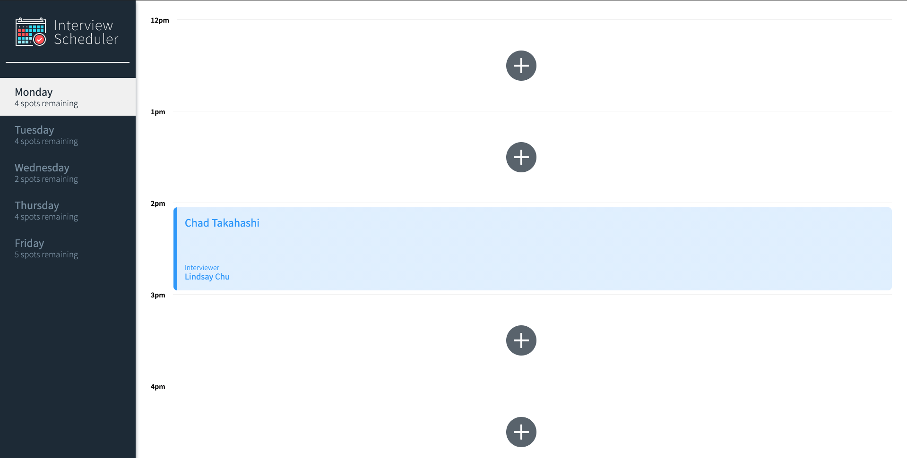

# Interview Scheduler

## Setup

Install dependencies with `npm install`.

## Running Webpack Development Server

```sh
npm start
```

## Running Jest Test Framework

```sh
npm test
```

## Running Storybook Visual Testbed

```sh
npm run storybook
```

## Description

Interview scheduler is an application built with react. User is able to look at available appointment spots, add, edit and cancel appointments. The page will update without refreshing. The application component was built with Storybook. 

Integration testing done with Jest, end to end test with Cypress. Test coverage 100%

Please see below screen shots of the app





